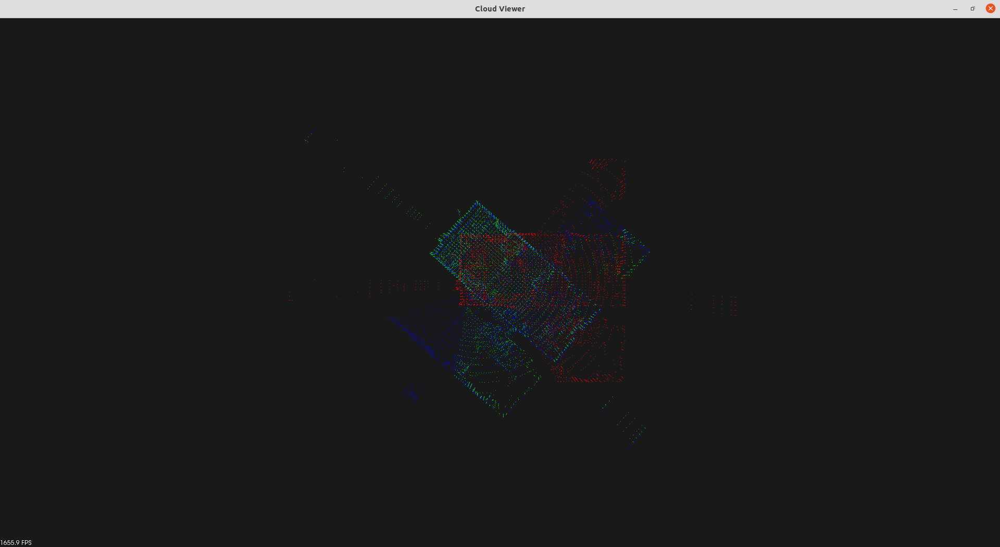

# PointCloud-Registration-Implementation
This is a C++ implementation of the Iterative Closest Point (ICP) algorithm using PCL and Eigen libraries. 

I also plan to implement the Normal Distributions Transform (NDT) and Generalized ICP (G-ICP) algorithms in the future.

## Dependencies

- PCL library

## Build & Compile

```cpp
mkdir build && cd build
cmake ..
make
```

## Registration

Before running the executable, make sure that the "source.pcd" and "target.pcd" files are located in the resources directory.

```cpp
./icp_test [source.pcd] [target.pcd]
```

## Result
Source cloud : red
Target cloud : blue
Aligned cloud : green

